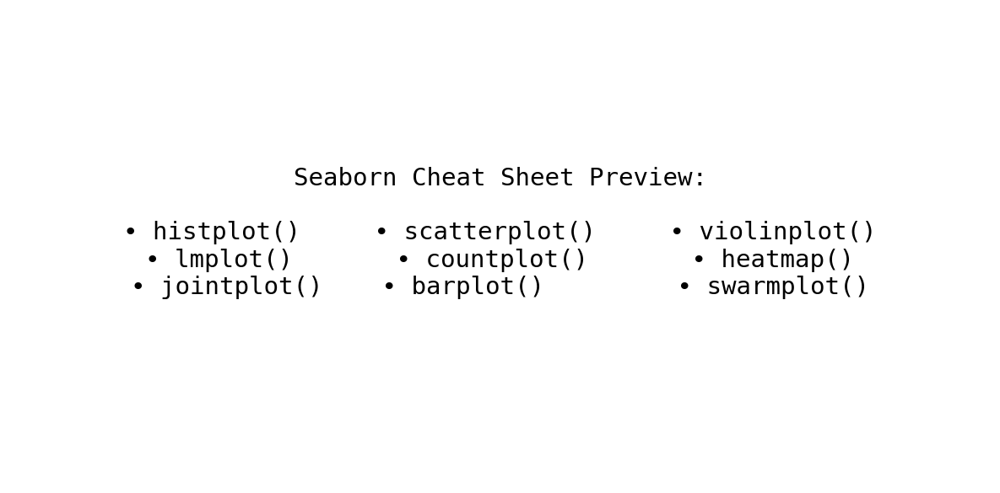

# 📊 Seaborn Plot Cheat Sheet

Welcome to the **Seaborn Plot Cheat Sheet** – a compact, printable reference for the most commonly used Seaborn visualization functions.

---

## 🔍 Overview

This cheat sheet covers the following plot categories:

- **Distribution**: `histplot`, `kdeplot`, `boxplot`, `violinplot`
- **Relationships**: `scatterplot`, `lmplot`, `jointplot`, `pairplot`
- **Categorical**: `countplot`, `barplot`, `pointplot`, `stripplot`, `swarmplot`
- **Time & Matrix**: `lineplot`, `heatmap`, `clustermap`

Each plot includes a short description and its most typical use case.

---

## 📄 Download PDF

You can download the full PDF here:

👉 **[Download Seaborn_CheatSheet_EN.pdf](Seaborn_CheatSheet_EN.pdf)**

*(Note: The PDF might not display directly in the browser, but you can easily download it to view on your computer.)*
---

## 🧪 Preview

Here’s what the cheat sheet looks like:

---

## 📁 Contents

| File | Description |
|------|-------------|
| `Seaborn_CheatSheet_EN.pdf` | The printable cheat sheet |
| `seaborn_cheatsheet.ipynb` | Code that generates the PDF |
| `assets/preview.png` | Screenshot preview for GitHub |
| `assets/logo.png` | Optional project icon |

---

## ✨ Author & Inspiration

Created by Michael, inspired by hands-on data science learning and visualization best practices.

---

## 📌 License

This project is licensed under the MIT License – feel free to use, share, and adapt!
